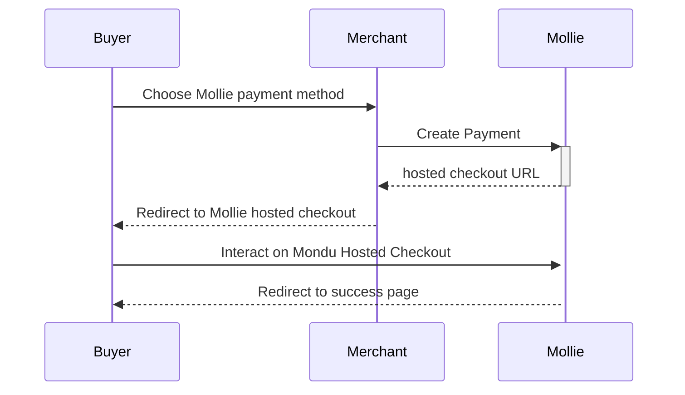

This is a [Next.js](https://nextjs.org/) project that utilizes Mollie's node JS library.


## Payment Flow



## Getting Started

After cloning the project, create your own copy of the environment file:

```bash
cp .env.example .env.local
nano .env.local
```

You'll need your own Mollie API key from Mollie's merchant dashboard. You can also specify a domain and webhook URL.

If no domain is set, we will simply use localhost for redirects. If no webhook URL is set, webhooks will fail.

Then, run the development server:

```bash
npm run dev
# or
yarn dev
# or
pnpm dev
# or
bun dev
# or
deno dev
```

Open [http://localhost:3000](http://localhost:3000) with your browser to see the result.

## Todo

✅ make payments work

✅ log webhooks

▫️ Auth/Capture

▫️ Get payment methods from methods API

▫️ list recent payments

## Deploy on Vercel

The easiest way to deploy your Next.js app is to use the [Vercel Platform](https://vercel.com/new?utm_medium=default-template&filter=next.js&utm_source=create-next-app&utm_campaign=create-next-app-readme) from the creators of Next.js.

Check out our [Next.js deployment documentation](https://nextjs.org/docs/deployment) for more details.
