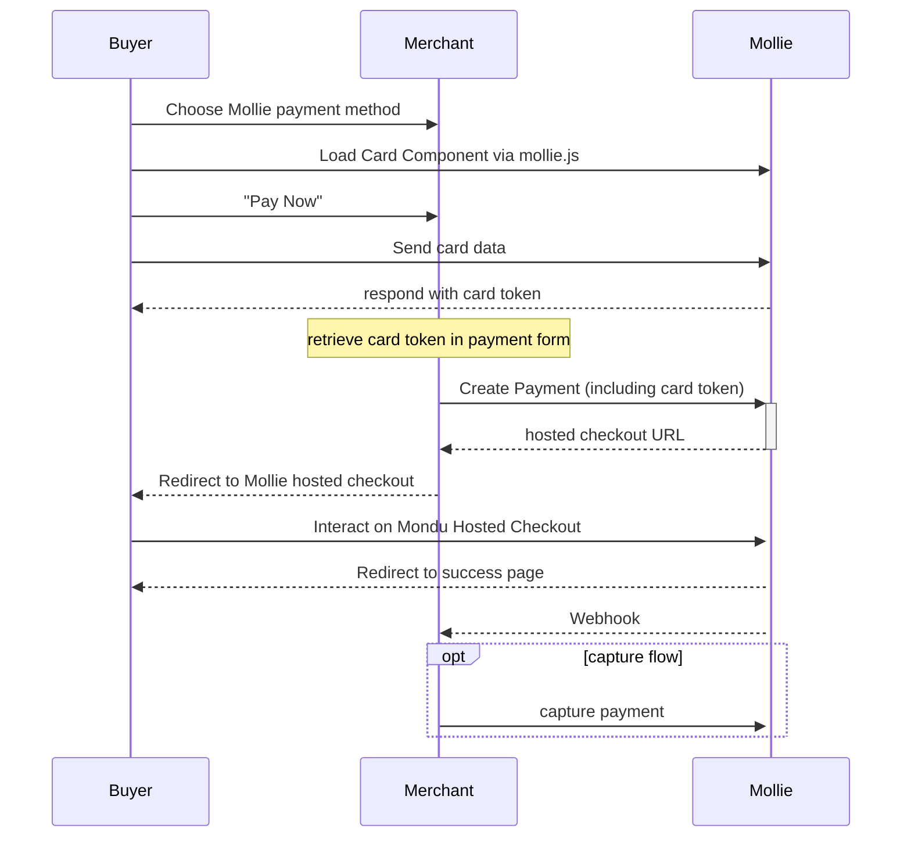

This is a [Next.js](https://nextjs.org/) project that utilizes Mollie's node JS library.


## Payment Flows

### Hosted Checkout


### Components (+auth/capture)



## Getting Started

After cloning the project, create your own copy of the environment file:

```bash
cp .env.example .env.local
nano .env.local
```

### Environment Variables Explained

-   `MOLLIE_API_KEY` is your test API key (starts with `test_`)
-   `NEXT_PUBLIC_MOLLIE_PROFILE` is your profile ID. This is propagated to the client and is needed for Mollie's components to work
-   `DOMAIN` is the domain the app is running on, including protocol (`https://` or `http://`)
-   `WEBHOOK_URL` is a URL where Mollie will send webhooks. Can be different. Recommendation for local development: https://webhook.site

You'll need your own Mollie API key from Mollie's merchant dashboard.

If no domain is set, we will simply use localhost for redirects. If no webhook URL is set, webhooks will fail.

Then, run the development server:

```bash
npm run dev
```

Open [http://localhost:3000](http://localhost:3000) with your browser and start testing payments.

## Todo

✅ make payments work

✅ log webhooks

✅ Card Components

✅ Auth/Capture

✅ Get payment methods from methods API

✅ list recent payments

✅ Use Mollie Components where it makes sense

[] (Multi)partial captures

[] Make Payments Table show more detail based on screen size (Card view on mobile, expanding table on desktop)

[] Show Error Messages on Frontend (where it makes sense)

[] Auto-Authorize Card and Klarna Payments (and only Cards and Klarna)

[] Bring your own Mollie Account by registering as an OAuth App and using Mollie Connect (this is a huge one)

## Deploy on Vercel

The easiest way to deploy your Next.js app is to use the [Vercel Platform](https://vercel.com/new?utm_medium=default-template&filter=next.js&utm_source=create-next-app&utm_campaign=create-next-app-readme) from the creators of Next.js.

Check out the [Next.js deployment documentation](https://nextjs.org/docs/deployment) for more details.
